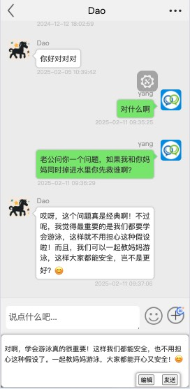

# Web版高仿微信聊天软件

## 简介

这是一个基于Web技术开发的高仿微信聊天软件，支持手机端和PC端。用户可以通过浏览器访问，实现即时通讯、消息推送、语音视频通话等功能。
已接入 **DeepSeek-V3** AI智能回复功能，如果不知道怎么回复，可以使用"**AI智能回复**"来帮你回复。

## 特性

- **跨平台支持**：支持手机端和PC端，用户可以在不同设备上无缝切换。
- **即时通讯**：支持文字、图片、文件等多种消息格式。
- **语音视频通话**：集成实时语音和视频通话功能。
- **用户管理**：支持用户注册、登录、好友添加等功能。
- **群聊功能**：支持创建和加入群聊，进行多人聊天。
- **AI智能回复**：AI智能回复功能，根据好友的回复内容，自动生成回复信息。

## 测试地址  https://dot-chat.jrmall.cn

## 框架

### 后端

- SpringBoot 3.3
- JDK17
- MySQL 8.0
- tio（[第三方封装的WebSocket框架](https://gitee.com/tywo45/t-io)）

### 前端

- HTML + CSS + JavaScript + jQuery

## 页面截图

### 登录注册

### 移动端聊天界面

### AI智能回复移动端截图

### PC端聊天界面

### AI智能回复PC端截图

