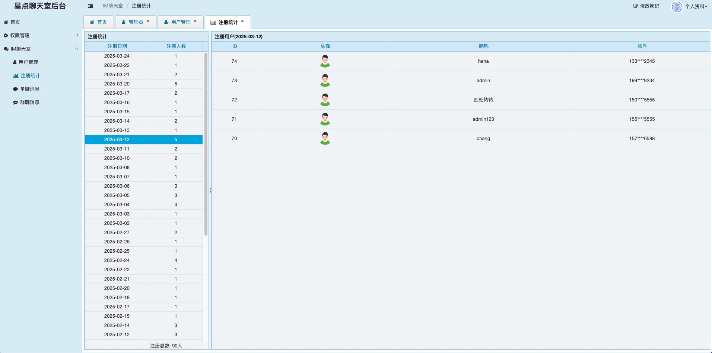
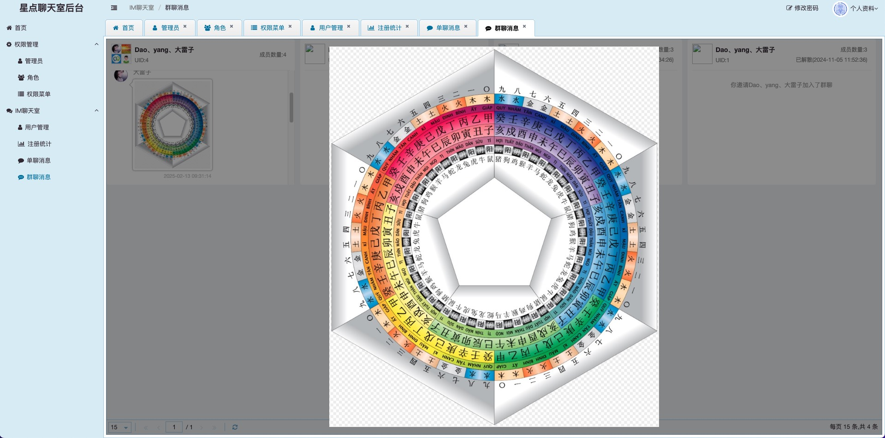
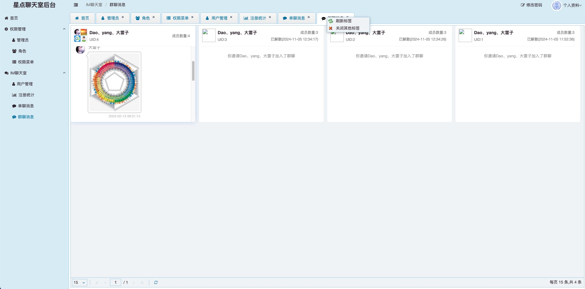

# Web版高仿微信聊天软件

## 简介

这是一个基于Web技术开发的高仿微信聊天软件，支持手机端和PC端。用户可以通过浏览器访问，实现即时通讯、消息推送、语音视频通话等功能。
已接入 **DeepSeek-V3** AI智能回复功能，如果不知道怎么回复，可以使用"**AI智能回复**"来帮你回复。

## 特性

- **跨平台支持**：支持手机端和PC端，用户可以在不同设备上无缝切换。
- **即时通讯**：支持文字、图片、文件等多种消息格式。
- **语音视频通话**：集成实时语音和视频通话功能。
- **用户管理**：支持用户注册、登录、好友添加等功能。
- **群聊功能**：支持创建和加入群聊，进行多人聊天。
- **AI智能回复**：AI智能回复功能，根据好友的回复内容，自动生成回复信息。

## 聊天室体验地址  https://dot-chat.jrmall.cn
## 管理后台登录地址  https://dot-admin.jrmall.cn/ 
`体验账号: 13000000000 密码: 888888`

## 框架

### 后端

- SpringBoot 3.3
- JDK17
- MySQL 8.0
- tio（[第三方封装的WebSocket框架](https://gitee.com/tywo45/t-io)）

### 前端

- HTML + CSS + JavaScript + jQuery

## 部署

### 1. 配置下列环境变量或在启动参数中添加
```
    DB_HOST=127.0.0.1;
    MYSQL_DB_NAME=dot_chat;
    MYSQL_PASSWORD=****;
    MYSQL_USERNAME=dot_chat;
    REDIS_PASSWORD=****
    DEEP_SEEK_API_KEY=key****(dot-chat-server需要)
    
```
### 2. 配置文件上传路径和域名
```
    配置前缀:mat.upload
    本地上传参考 application-dev.yml
    阿里云oss上传参考 application-prod.yml
```
### 3. NGINX 部署

1. dot-chat-admin 部署只需要转发端口即可
2. dot-chat-server 部署需要配置nginx转发api的端口(8089)和websocket端口(9326),注意:这个服务Maven打包时间需要注意,由于依赖了ffmpeg全包太大,只依赖了mac系统和Linux系统的,根据自己的系统自己修改pom文件,不依赖会影响上传视频功能
```
参考下面配置:
     location / {
    	proxy_redirect off;
    	proxy_set_header Host $host;
    	proxy_set_header X-Real-IP $remote_addr;
    	proxy_set_header X-Forwarded-For $proxy_add_x_forwarded_for;
        proxy_pass http://127.0.0.1:8089; 
    }
    location /websocket/  {
       proxy_pass http://127.0.0.1:9326/;
       proxy_http_version 1.1;    
       proxy_set_header Upgrade $http_upgrade;    
       proxy_set_header Connection "Upgrade";    
       proxy_set_header X-real-ip $remote_addr;
       proxy_set_header X-Forwarded-For $remote_addr;
     }
```
3. dot-chat-web 部署只需要把webapp目录下文件复制到Nginx的部署目录即可,注意js目录中的接口域名需要修改为自己的


## 页面截图

### 登录注册


### 移动端聊天界面


### AI智能回复移动端截图


### PC端聊天界面


### AI智能回复PC端截图


### 管理后台页面截图






